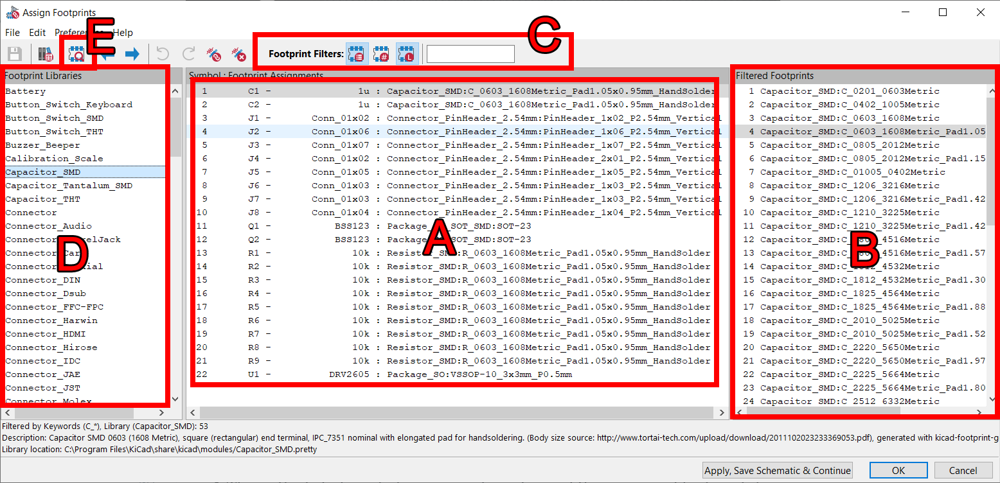
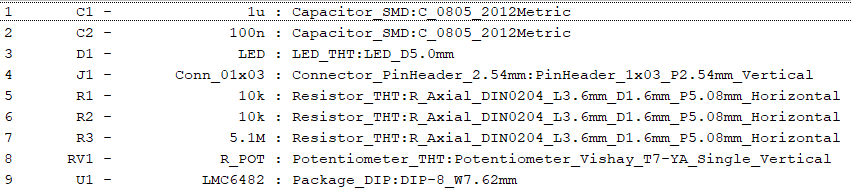
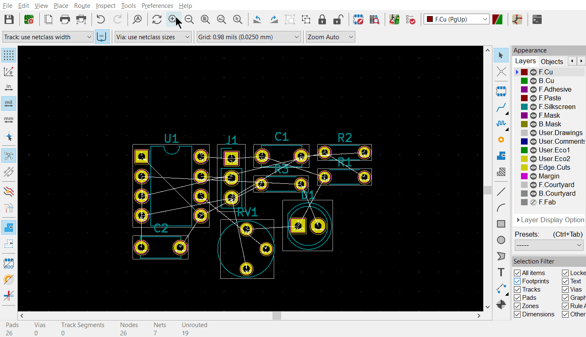
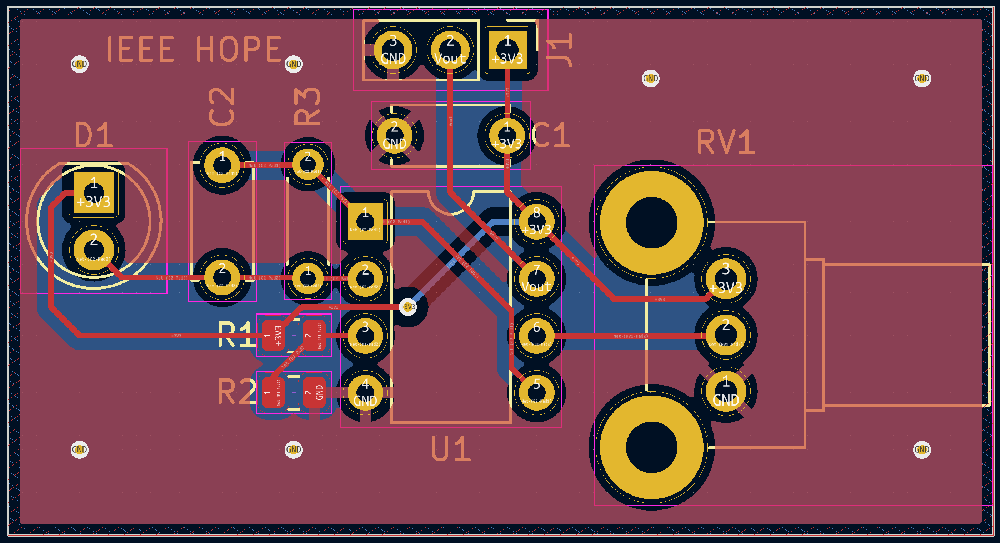
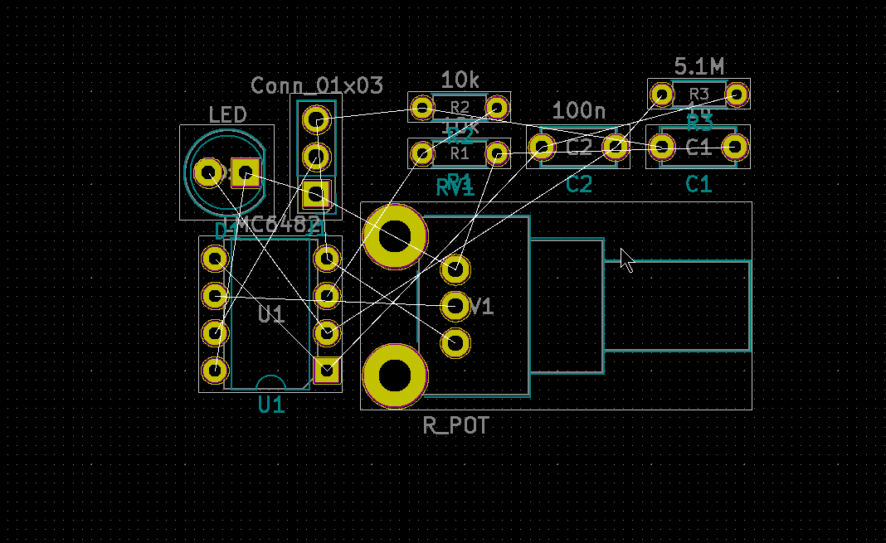
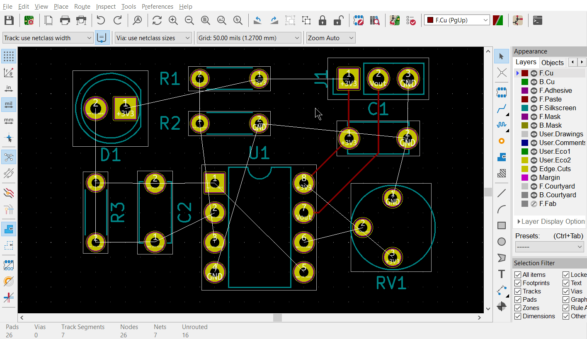
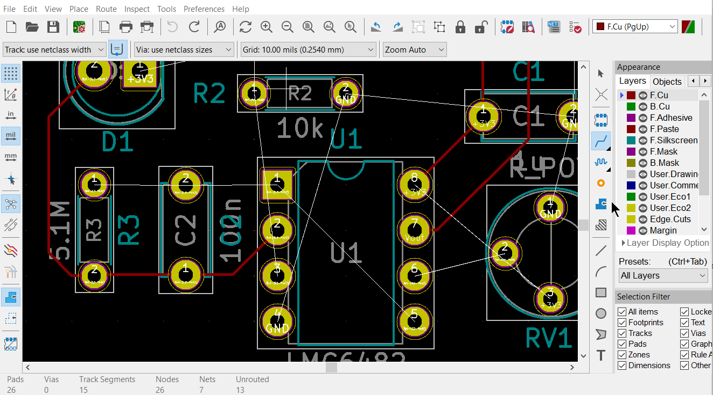

Light Sensor Lab - Layout
==============

* Do not remove this line (it will not be displayed)
{:toc}

<h1>HOPE Lab 2: Light Sensor Layout</h1>

<article>
<!--kg-card-begin: html-->
<!--kg-card-end: html--><!--kg-card-begin: html-->      

<a href="https://ieee.berkeley.edu/hope/" style="font-weight: 700;">HOPE Main Page</a>

<!--kg-card-end: html--><!--kg-card-begin: markdown-->
In this KiCad activity, we'll be laying out the PCB for the schematic we created last week. Before you get started, if you haven't already done the reading for this week we recommend taking a <a href="https://ieee.berkeley.edu/hope-lab-2-layout/ieee.berkeley.edu/hope-rd-layout">look here</a>.

<!--kg-card-end: markdown--><!--kg-card-begin: markdown--><h2 id="findingsomeparts">Finding Some Parts</h2>

Before you move get to assigning footprints, you should get familiar with real parts and how to find them. Follow this <a href="https://ieee.berkeley.edu/hope-light-sensor-digikey-search/">hands-on Digikey search walkthrough</a>.

<strong>You will need to show your Digikey cart from this activity for checkoff, so don't skip it!</strong>

<!--kg-card-end: markdown--><!--kg-card-begin: markdown--><h2 id="footprintassignment">Footprint Assignment</h2>

What should have been completed so far is the circuit <strong>schematic</strong>. That is, we have transcribed our circuit's components and their connections into a format that KiCad, and hopefully others, can understand. Now, we need to tell KiCad what each of our parts look like physically on the board. First, we need to assign what each component actually looks like in the real world. Or at least, how they will look on our PCB. These representations are called <strong>footprints</strong>.

If you'd like to view a quick video tutorial and walkthrough of how to assign footprints, check out the video below. If not, continue forward with the steps.

<!--kg-card-end: markdown--><figure class="kg-card kg-embed-card"><iframe width="200" height="113" src="../assets/lab2b/5-hH0veXqUk.html" frameborder="0" allow="accelerometer; autoplay; clipboard-write; encrypted-media; gyroscope; picture-in-picture; web-share" allowfullscreen="" title="Mihai Tudor KiCad Footprint Tutorial"></iframe></figure><!--kg-card-begin: markdown--><ol>
<li>Go to <code>Tools → Assign Footprints</code>. Note that it may take a while to open as KiCad loads in all the footprint libraries. We have labeled the different sections of the window from A - E for your ease in following our instructions.</li>
</ol>
<!--kg-card-end: markdown--><figure class="kg-card kg-image-card kg-width-wide kg-card-hascaption"><figcaption>"Assign footprints" window</figcaption></figure>
We have some suggested footprints to use for this lab below, but feel free to choose any that you like (so long as it makes sense for the part). 
<!--kg-card-begin: html-->   <!--kg-card-end: html--><!--kg-card-begin: markdown--><h1 id="pcblayout">PCB Layout</h1>
<h2 id="pcblayoutsetup">PCB Layout Setup</h2>

If you'd like to see a walkthrough of how to layout your PCB, check out the video below. It goes through the entire process of PCB layout. If not, continue forward with the steps.

<!--kg-card-end: markdown--><figure class="kg-card kg-embed-card"><iframe width="200" height="113" src="../../assets/lab2b/7FXaS7H3_CY.html" frameborder="0" allow="accelerometer; autoplay; clipboard-write; encrypted-media; gyroscope; picture-in-picture" allowfullscreen=""></iframe></figure><!--kg-card-begin: markdown--><ol>
<li>Update your PCB from schematic to start off your layout. To do this, open the PCB Editor from either the main window or the schematic editor (second bottom from the right in the toolbar). If this is the first time you are opening the PCB editor you'll likely get a pop-up that asks to configure the global footprint library table; select the recommended option just like when setting up the schematic editor from last time. Click "Update PCB with Change Made to Schematic" in the top toolbar. It looks like this:</li>
</ol>
<!--kg-card-end: markdown--><!--kg-card-begin: html-->   <!--kg-card-end: html--><!--kg-card-begin: markdown-->
If you've done everything correctly so far, there should be no errors in the "Update PCB from schematic" window, as shown above.

If the "Update PCB from schematic" button is greyed out, make sure you're opening up your KiCad project from the ".kicad_pro" file. There's also individual files such as ".kicad_sch" but they're not inherently connected to each other so you won't be able to synchronize your schematic and layout.

Now, let's do some basic environment setup before we actually getting started.

<ol start="2">
<li>

For this project at least, make sure that you are set up to use mils. Press the "mil" button in the left sidebar. (What is mils and why is it used for layout? Try searching around online if you're interested)

</li>
<li>

Set your grid size to a standard 50 or 25 mil grid. When working with others' designs, using a common grid unit size will help make sure your components and tracks line up with theirs.

</li>
<li>

Get to the board setup window by clicking on the board setup tool in the top toolbar. It looks like this:

</li>
</ol>
<!--kg-card-end: markdown--><!--kg-card-begin: html-->   <!--kg-card-end: html--><figure class="kg-card kg-image-card kg-card-hascaption"><figcaption>Pre-layout setup</figcaption></figure><!--kg-card-begin: markdown-->
In <code>Board Stackup-&gt;Physical Stackup</code> make sure <code>Copper layers</code> is set to 2. (This should be the default). Click <code>OK</code> to close the window

<blockquote>

For those with some PCB design experience, feel free to set your design rules such that your board will fall under <a href="https://bayareacircuits.com/capabilities/?ref=ieee.berkeley.edu">Bay Area Circuit's Standard Capabilities</a>

</blockquote>
<h2 id="placementandrouting">Placement and Routing</h2>

In the end, we want something that looks like this:

<!--kg-card-end: markdown--><figure class="kg-card kg-image-card kg-card-hascaption"><figcaption>Example of a completed layout (with slightly differing footprints)</figcaption></figure><!--kg-card-begin: markdown--><ol start="5">
<li>First step is to move and orient components as you would like them to be on the board. It is recommended to position the op-amp IC first, and to keep the inputs/outputs accessible at board edges. Move components by mousing over them and pressing '<strong>m</strong>'. To rotate, type '<strong>r</strong>'. Click to place back down.</li>
</ol>
<!--kg-card-end: markdown--><figure class="kg-card kg-image-card kg-card-hascaption"><figcaption>Part placement and orientation (note that the potentiometer footprint differs)</figcaption></figure><!--kg-card-begin: markdown--><ol start="6">
<li>

Finish placing the components on the board. Feel free to place them however you wish, but try to minimize the number of crossing white wires. These wires (called the "<em>ratsnest</em>") indicate <strong>intended</strong> connections as defined in the schematic.

<blockquote>

Try disabling the view of the 'F.Fab' layer by unchecking its checkbox in the 'Layer Manager' window on the right. It will help make things look neater.

</blockquote>
</li>
<li>

Routing: drawing out the physical connections between the components. <strong>First, you may want to change your grid size to something smaller, such as 10 mil.</strong> You need to route a physical track for each white line you see connecting different pins. Use the 'Highlight Net' tool to easily visualize to-be-made and made connections.

</li>
</ol>
<!--kg-card-end: markdown--><figure class="kg-card kg-image-card kg-card-hascaption"><figcaption>Routing Traces</figcaption></figure><!--kg-card-begin: markdown--><blockquote>

Don't worry too much about GND connections in your routing, and do the other connections first. Take a peek at the next step about ground planes to understand why! You can hide the GND ratnests by going to the <code>Nets</code> tap on the right window, and clicking the eye icon next to GND

</blockquote>
<ol start="8">
<li>

Delete track segements by selecting the segment and pressing '<strong>Del</strong>'. To delete the full track, select a segment and press '<strong>U</strong>' to select the entire track and then press '<strong>Del</strong>' to delete. You can also right click for more options.

</li>
<li>

You may realize that one layer might not be enough to ensure no overlaps. Use func. key '<strong>Page Down</strong>' to switch to the bottom layer. '<strong>Page Up</strong>' will return you to the top layer. You can use vias to connect traces on different layers.

</li>
</ol>
<blockquote>

Vias are an available by: Pressing '<strong>v</strong>' while in trace routing mode (i.e. you're in the middle of routing a trace and want to jump to the other layer) or using the 'add via' button in the right tool panel.

</blockquote>
<!--kg-card-end: markdown--><figure class="kg-card kg-image-card kg-card-hascaption"><figcaption>Switching routing to the back side copper</figcaption></figure><!--kg-card-begin: markdown--><ol start="10">
<li>

If you find it hard to draw out traces for all the connections, you should try to move and reorient the components themselves.

</li>
<li>

Now let's define the board outline. Set your grid size to something large, 50 mil+. This will make drawing an outline easier. Add edge cuts for the board. These are the physical boundaries of your board. Select the <code>Edge.Cuts</code> layer and, using the line tool, draw a rectangle that contains all the footprints and traces on your board.

</li>
<li>

Add a ground plane/ground pour to cover this board on both the top and bottom layers. A ground plane is a fill of copper dedicated entirely to the GND net. It is <em>generally</em> a good idea because it makes routing easier and reduces ground noise. It's also the reason why you don't connect ground with traces above.To do this:

<ol>
<li>Select the 'F.Cu' (Front Copper) or 'B.Cu' layer and click the <code>Add filled zones</code> icon in the right toolbar. Click on a corner of your board outline. Select <code>GND</code> as the net. Check <code>Constrain to H, V, and 45 degrees</code> and then press <code>OK</code>.</li>
<li>Draw the ground plane polygon. Make sure it follow your Edge Cuts outline. Click your starting point to close the ground pour polygon.</li>
</ol>
</li>
</ol>
<!--kg-card-end: markdown--><!--kg-card-begin: markdown--><ol start="13">
<li>Repeat the above steps again to make a second ground plane for the other 
copper layer ('F.Cu' or 'B.Cu' that you have not yet done).</li>
</ol>
<blockquote>

If you update any other part of your board (add new traces, move a component, etc.), press '<strong>b</strong>' to re-fill all filled zones. If you find the filled zones visually impairing, you can unfill with 'ctrl+b' or change how they are viewed. Fill visibility buttons exist on the left toolbar, try to find them!

</blockquote>
<!--kg-card-end: markdown--><!--kg-card-begin: markdown--><h1 id="labcheckoff">Lab Checkoff</h1>

Make sure you have...

<ul>
<li>

Completed schematic from the previous lab

</li>
<li>

Completely routed PCB layout (no remaining ratsnest lines, has ground planes, passes DRC, etc.)

</li>
<li>

Proper board edges defined

</li>
<li>

Reasonable layout

</li>
<li>

Digikey Cart (see Finding Some Parts Section)

</li>
</ul>

<a href="https://ieee.berkeley.edu/hope/">Back to HOPE main page</a>

<!--kg-card-end: markdown-->

</article>