USB Charger Lab - Components
==============

* Do not remove this line (it will not be displayed)
{:toc}

<h1>USB Charger: Components</h1>

<article>
<!--kg-card-begin: html-->

<a href="https://ieee.berkeley.edu/hope/" style="font-weight: 700;">HOPE Main Page</a>

<!--kg-card-end: html--><!--kg-card-begin: markdown--><h1 id="the-big-picture">The Big Picture</h1>

Your charger acts as a USB <em>upstream device</em> that supplies power to a <em>downstream device</em> being charged. In order for it to be functional and reliable, your charger needs to:

<ul>
<li>

Provide physical power connectors. The output needs to be a USB-A female receptacle, and the input should be able to connect to wires from a battery holder.

</li>
<li>

We want to convert a 3 AA battery DC supply (3.6V - 4.6V) to a 5V DC supply. The output load is unknown and may change over time (i.e. your phone chooses how much current to draw by effectively changing the output "resistance").

</li>
<li>

Indicate to the downstream device that it is a "dedicated charging port (DCP)". If you don't, your device will charge slowly.

</li>
<li>

Protect itself and the downstream device (device being charged) against high voltage transients and voltage reverse polarity.

</li>
<li>

Protect both the input and output from short circuit conditions.

</li>
<li>

Minimize cost. It's always optimal to design a cheaper product with equal performance, if possible.

</li>
</ul>
<h1 id="specifications">Specifications</h1>

The following is a summary of the general specs and design requirements.

<ul>
<li>

Input voltage of 3.6V to 4.8V (3 AA).

</li>
<li>

Output 1x USB charging port compliant with USB Battery Charging 1.2.

</li>
<li>

Green LED indicating that the charger is powered.

</li>
<li>

Some form of protection circuitry as mentioned in The Big Picture. More on this later in the lab.

</li>
<li>

Relatively small form factor and be mechanically capable of attaching to a 3 AA battery housing.

</li>
<li>

Minimize cost.

</li>
</ul>

<h1 id="choosing-parts">Choosing Parts</h1>
<!--kg-card-end: markdown--><!--kg-card-begin: html--> 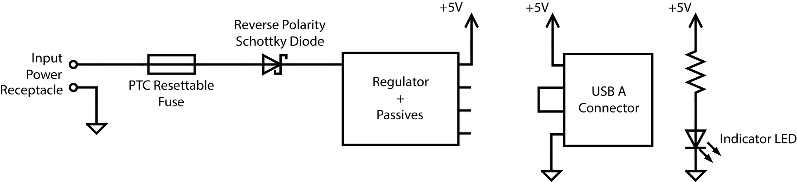  <!--kg-card-end: html--><!--kg-card-begin: markdown-->
With the general specs in mind, it is time to <em>"build"</em> a circuit. Luckily, a high-level schematic diagram following the general specs has been already created for you, but the parts needed to implement it have yet to be chosen. Your job is to:

<ul>
<li>Find out what is avaliable: search <a href="https://www.digikey.com/?ref=ieee.berkeley.edu">DigiKey</a>. For other projects, <a href="https://www.mouser.com/?ref=ieee.berkeley.edu">Mouser</a> and online part search engines such as <a href="https://www.octopart.com/?ref=ieee.berkeley.edu">Octopart</a> may be useful.</li>
<li>Pick parts following the order below. As you do this, <strong>create a Bill of Materials (BOM)</strong>. A BOM is a spreadsheet or table with the quantity, value*, Manufacturer part number, distributor (e.g. Digikey) part number, cost, and other information about the parts you decide to use. For this BOM, please <strong>use this <a href="https://docs.google.com/spreadsheets/d/1ZZAnW61lbqi8A5PHymeQs3MktsaBvQEssZroThjktFo/edit?ref=ieee.berkeley.edu">template</a>!</strong></li>
</ul>
<blockquote>

*The "Value" column in datasheets usually refers to <em>passive</em> values, such as the resistance of a resistor or the capacitance of a capacitor. Feel free to leave it blank for other kinds of components, or use it however you'd like. The "Reference Designator" column refers to the annotated symbol reference, feel free to leave it blank until the schematic has been finished.

</blockquote>
<!--kg-card-end: markdown--><!--kg-card-begin: markdown--><h2 id="a-note-on-packaging">A note on packaging</h2>

We recommend selecting the <em>Packaging</em> filter while searching for components in this lab, which is <em>not</em> the form factor the component comes in (that is called Package/Case). Packaging is how the distributor organizes and ships your components; Tape and Reel, Digi-Reel, Tape and Box all have minimum quantities in the thousands and should be avoided (they are types of packaging that allow for components to be fed into machines for assembly). For hobbyists, <strong>Cut Tape</strong> for small parts and <strong>Bulk/Tube/Strip</strong> (typical for larger parts) are much better. You may see other packaging names; search the internet to find out more!

<!--kg-card-end: markdown--><!--kg-card-begin: html--> 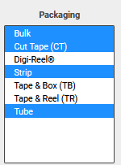  <!--kg-card-end: html--><!--kg-card-begin: html--> 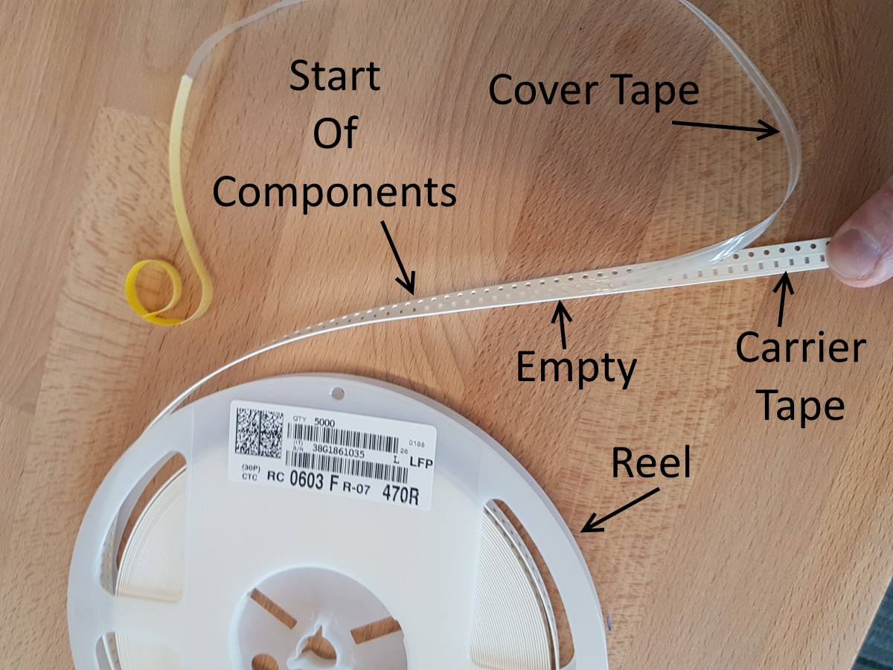  <!--kg-card-end: html--><!--kg-card-begin: markdown--><h2 id="understanding-usb">Understanding USB</h2>

A <a href="https://en.wikipedia.org/wiki/USB_(Physical)?ref=ieee.berkeley.edu#Pinouts">USB Type-A female receptacle</a> has 4 pins:

<!--kg-card-end: markdown--><!--kg-card-begin: html--><table style="width: 30%; margin: auto; display:block">
<thead>
<tr>
<th><strong>Pin</strong></th>
<th><strong>Name</strong></th>
<th><strong>What's it for?</strong></th>
</tr>
</thead>
<tbody>
<tr>
<td>1</td>
<td>VBUS</td>
<td>Put ~5V here</td>
</tr>
<tr>
<td>2</td>
<td>D-</td>
<td>Charger detection</td>
</tr>
<tr>
<td>3</td>
<td>D+</td>
<td>Charger detection</td>
</tr>
<tr>
<td>4</td>
<td>GND</td>
<td>Put ground here</td>
</tr>
</tbody>
</table><!--kg-card-end: html--><!--kg-card-begin: html--> 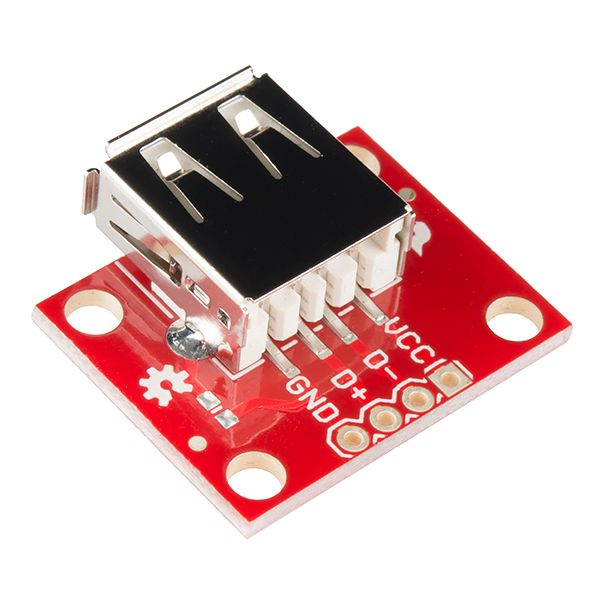  <!--kg-card-end: html--><!--kg-card-begin: markdown--><h2 id="digikey-usb-receptacle">Digikey: USB Receptacle</h2>
<ol>
<li>

What component are we looking for? A USB-A receptacle, which is a type of connector. This means we need to head to the <code>Connectors, Interconnects</code> section and look for the correct category. Click on the category and it should take you to a list of all of the parts in that category.

</li>
<li>

Now we are at the results page. There should be approximately 3,000 products to choose from and 19 categories to filter the selection by (that's a lot).

</li>
<li>

As a preliminary step, check our standard filters: <strong>In-Stock</strong>, <strong>Datasheet</strong>, and <strong>Exclude</strong> Marketplace ("Marketplace" components are sold by third parties often with long lead times and high shipping costs). Part Status: <strong>Active</strong> is also good to include, ensuring you don't use discontinued parts.

</li>
</ol>
<blockquote>

Note: Due to the global parts shortage, we will be lenient about out-of-stock parts for this lab. Of course, for your project you must only choose in-stock parts. You should be able to find in-stock components, though.

</blockquote>
<ol start="4">
<li>

It turns out we mostly only care about two categories, <em><strong>connector type</strong> and <strong>gender</strong>.</em>

</li>
<li>

Select the correct connector type and gender filter (Hint: if you're unsure look above again to see what type of part we are looking for).

</li>
<li>

Now we should have narrowed down our search to around 275 results, but how do we select the final component? Try filtering by <strong>current rating</strong> * (see earlier in this lab) and the <strong>mounting type</strong>. We want a "right angle connector" which allows us to plug in parallel to the board (see image above), as opposed to a "vertical connector", which sticks out normal to the board.

</li>
<li>

Keep in mind that one of our specifications is minimum <strong>cost</strong>. So from here we can find the 'Unit Price USD' column and if you click the up-arrow underneath, it will sort all of the results by cost.

</li>
<li>

You should now have your final USB-A receptacle chosen. Click on its DigiKey part number for more information on the component and fill out the appropriate columns in your BOM.

</li>
</ol>
<blockquote>

*Feel free to set the current rating to 2A for now, you'll calculate the current rating below.

</blockquote>
<!--kg-card-end: markdown--><!--kg-card-begin: html--> 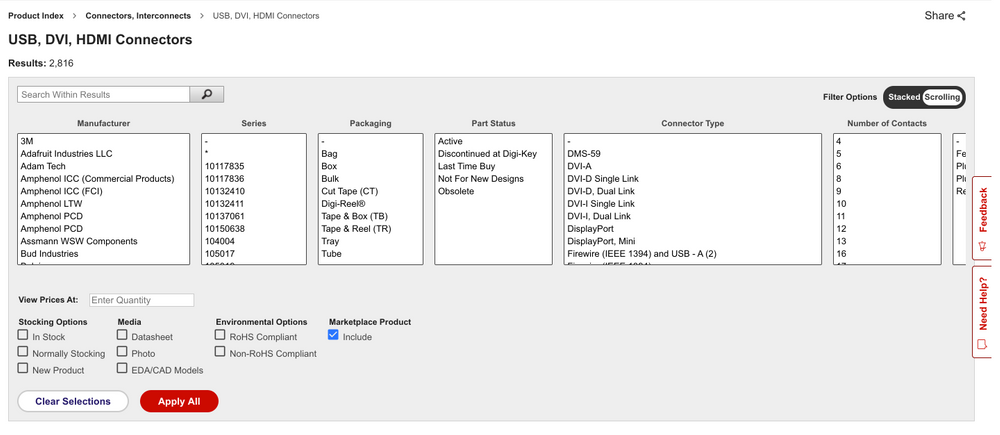  <!--kg-card-end: html--><!--kg-card-begin: markdown--><h2 id="usb-charging-spec">USB Charging Spec</h2>

Read Section 4.4 "Dedicated Charging Port" in the <a href="https://drive.google.com/file/d/1BNdCfBetrr-bBWu24U74mBzQXfStZBR5/view?usp=sharing&amp;ref=ieee.berkeley.edu">USB Battery Charging Specification, Revision 1.2</a>. Make sure to pay attention to the third paragraph in part 4.4.1 "Required Operating Ranges." 
Answer the following questions:

<ol>
<li>

What is the allowable range of output (VBUS) voltages from your charger?

</li>
<li>

What is the maximum value of I_DEVCHG? Hint: Look at Table 5-2

<ul>
<li>Therefore, how much current must your charger be able to supply without shutting down if your charger output must stay above 2V? Hint: Look at Figure 4-2</li>
</ul>
</li>
<li>

If a device is drawing 0.25A, what is the minimum voltage the charger can output? Hint: Look at Figure 4-2

</li>
<li>

Your charger should connect the D+ and D- pins to indicate that it is a charging port. These pins can be connected in a variety of ways, but we'll simply short them together. See <a href="https://www.maximintegrated.com/en/design/technical-documents/tutorials/5/5801.html?ref=ieee.berkeley.edu">Figure 2 in this application note</a> for details on ways to configure this.

</li>
</ol>
<h2 id="reverse-polarity-protection">Reverse Polarity Protection</h2>

There are many ways to protect a circuit from being connected in reverse. One recommendation is to use a <a href="https://en.wikipedia.org/wiki/Schottky_diode?ref=ieee.berkeley.edu">Schottky diode</a>. A schottky diode is a special kind of diode with a <em>low forward voltage</em>, which is important for minimizing wasted energy (remember, P=IV, and an ideal diode would have V=0).

When choosing a protection diode, it is important to look at the diode's <strong>type</strong>, <strong>current rating</strong>, <strong>forward voltage</strong>, and <strong>DC reverse voltage</strong>.

First, navigate to the diodes:

<!--kg-card-end: markdown--><!--kg-card-begin: html--> 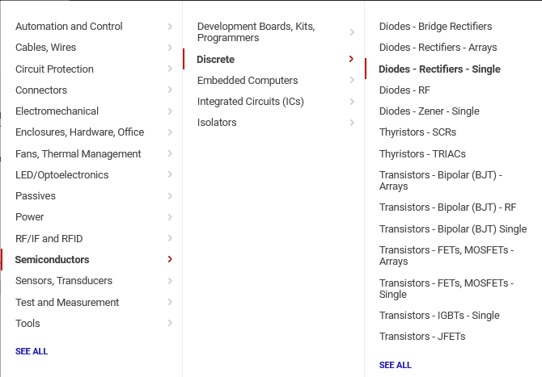  <!--kg-card-end: html--><!--kg-card-begin: markdown-->
Now check our standard filters: <strong>In-Stock</strong>, <strong>Datasheet</strong>, Part Status: <strong>Active</strong>, and <strong>Exclude</strong> Marketplace.

Select the Schottky <strong>type</strong> (ignore the "Reverse polarity" category, those are irrelevant specialty parts)

Our requirment for <strong>forward voltage</strong> here is no more than 400mV at 3A. This means that at 3A going into the regulator, we'll experience a 0.4V drop across the diode (at lower currents, this will be less). This drop is actually quite problematic, but we'll ignore it for later parts of the lab (fuse sizing) for convenience.

You should be able to find a reasonable diode now sorting by <strong>cost</strong> and <strong>making sure the package is hand-solderable</strong>.

Add the diode to your BOM.

Keep in mind that there are more solutions that what we've listed here with respect to reverse polarity protection; you may want to explore using a FET for higher-efficiency designs, for example.

<!--kg-card-end: markdown--><!--kg-card-begin: markdown--><h2 id="fuse">Fuse</h2>

To protect the switching regulator from large transient voltage spikes or dead shorts, we recommend using a <em>polyfuse</em>, aka PTC resettable fuse. This device heats up when high currents pass through it, increasing in resistance and thus effectively "opening" the circuit. After some time, the polyfuse will cool down and allow current to flow again.

To start, navigate to the PTC resettable fuse category:

<!--kg-card-end: markdown--><!--kg-card-begin: html--> 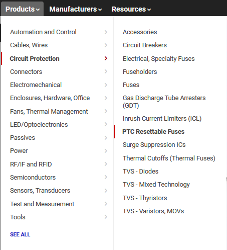  <!--kg-card-end: html--><!--kg-card-begin: markdown-->
As always, we'll need to filter things down a bit.

After selecting the <strong>Active</strong>, <strong>In-Stock</strong>, <strong>Datasheet</strong>, and <strong>Exclude</strong> Marketplace filters, we have about 2,000 parts.

Fuses have two major parameters:

<ul>
<li>

<strong>Hold current (Ih)</strong>: the maximum sustained current for which the fuse is guaranteed not to trip. For us, this requires a bit of math.

<ul>
<li>

Our regulator can output 1.5A out at 5V. Assuming the regulator has an 80% efficiency, use this power conservation equation to calculate the needed current on the input side: V_in * I_in * efficiency = V_out * I_out.

Hint: in the worst (max input current) case, the input voltage is our minimum, 3.6V.

</li>
</ul>
</li>
<li>

<strong>Trip current (It)</strong>: Let's set a maximum trip current of 5A; anything higher risks serious damage to our circuitry. You should see about 30 parts that fit these criteria. Choose based on <strong>package</strong> and <strong>cost</strong>.

</li>
</ul>
<!--kg-card-end: markdown--><!--kg-card-begin: markdown--><h2 id="light-emitting-diodes-leds">Light-Emitting Diodes (LEDs)</h2>

LEDs are typically not covered in great detail in lower-division classes. As the name implies, LEDs are a type of diode, a semiconductor device. Like other diodes, LEDs have a highly nonlinear relationship between voltage and current! Unlike resistors, they do <em>not</em> obey Ohm's law (V=IR, where V/I = constant R). Instead, you can think of them as having a highly variable resistance (V/I slope).

In the plot below, we can see that applying 1.5V to the LED will cause almost no current to flow; however, applying more than 2.3 or 2.4V will instantly burn out the LED (infinite current causes things to heat up rapidly).

<!--kg-card-end: markdown--><!--kg-card-begin: html--> 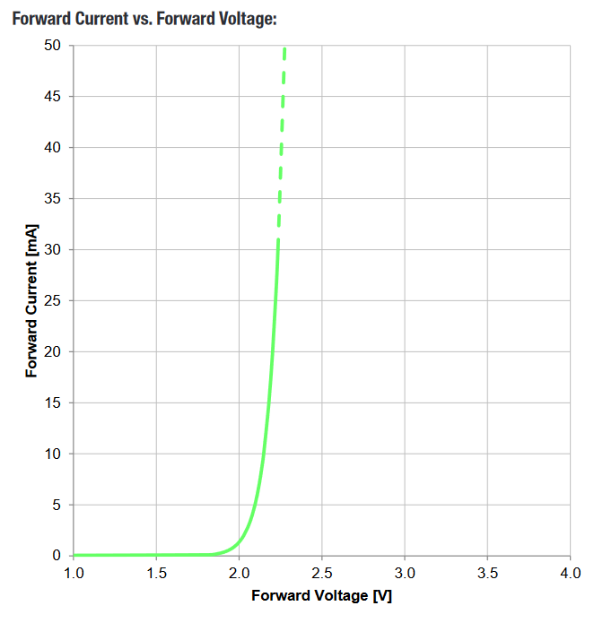  <!--kg-card-end: html--><!--kg-card-begin: markdown-->
Since we can't (cheaply) provide precisely 2.2V, we generally use a resistor in series with the LED to "drop" the remainder of the voltage from a typical (5V or 3.3V) supply in a stable manner. Without this, even slight variations in voltage would easily destroy the LED, as the current would spike!!

<!--kg-card-end: markdown--><!--kg-card-begin: html--> 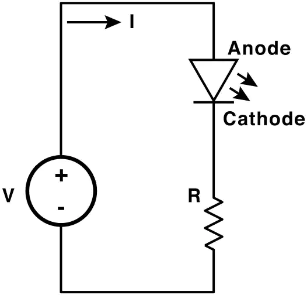  <!--kg-card-end: html--><!--kg-card-begin: markdown-->
In order to use an LED, we will follow this procedure:

<ol>
<li>Pick a desired current. This corresponds to the brightness; while every LED is a little different, for an indicator around 10-15 mA should be visible (more can be painful to look at).</li>
<li>Find the forward voltage at the current. In DigiKey, manufacturers typically use "test currents" of around 10-20 mA to calculate the "nominal forward voltage" listed in the search filters. In reality, the forward voltage will differ based on how much current is running through the LED (see above)!</li>
<li>Figure out what size resistor we need in series with the LED to ensure exactly the desired current will run through the LED with the given supply.</li>
</ol>

As an example using the graph above and a supply of 5V:

<ol>
<li>We pick 10mA.</li>
<li>The forward voltage appears to be around 2.2V at 10mA.</li>
<li>If we have a 5V supply and a drop of 2.2V across the LED, there will be 2.8V across the resistor in series with the LED. Using V=IR, we need a resistance of R=2.8V/0.010A = 280 Ohms!</li>
</ol>

We will start with the <code>LED Indication - Discrete</code> category; there are several categories of LEDs, but this one works well for indicators and has many parts.

Choose the standard general filters (<strong>In-Stock</strong>, etc.).

Pick using your newfound knowledge about <strong>forward voltage</strong> and <strong>test current</strong>, and confirm your choice by checking the datasheet. We also require that your chosed LED have a <strong>SMD</strong> footprint, not through-hole. Be sure to also choose an appropriate resistor near the value you calculated earlier with an SMD footprint too (we recommend choosing either <strong>0805 or 0603</strong> (imperial) SMD sizes for both the LED and resistor, but you'll notice LEDs often come in larger sizes too).

<!--kg-card-end: markdown--><!--kg-card-begin: markdown--><h2 id="switching-regulator">Switching Regulator</h2>

The switching regulator has been decided as the voltage conversion method. Your job is to find an <em>appropriate</em> switching regulator for this application.

<ul>
<li><strong>Output voltage</strong>: 5V. Must be able to be set up to output 5V. This means adjustable output types are ok so long as the necessary feedback network for a 5V output is implemented.</li>
<li><strong>Output Current</strong>: Must be able to output 1.5A, which is the desired USB charging current. Technically, the spec allows for significant voltage "droop" at 1.5A, or even chargers that drop <em>below</em> 2V before sourcing 1.5A. However, the behavior of switching regulators exceeding their max current limits is not always consistent.</li>
<li><strong>Input Voltage</strong>: 3.6V to 4.8V. Switching Regulators will have a defined input range. Most likely the only limit you will need to worry about is the lower limit of 3.6V as the upper limit will probably be much higher.</li>
<li><strong>Switching Frequency</strong>: above 100kHz. The non-DC frequency content of the regulator output is beyond the scope of this course, but there's plenty to explore here if you're interested.</li>
</ul>

We have two options that we have chosen for you that will meet all the above requirements and have the ability to output more current than we have set as the requirement above:

<ul>
<li><strong>LTC3872</strong></li>
<li><strong>TPS61023</strong></li>
</ul>

You are also free to look for other regulators that meet the above requirements. Search up these parts and take a quick look at their info pages on Digikey. We will hint that one of these will be easier to use for this lab than the other, so we recommend looking at both parts' datasheets.

<!--kg-card-end: markdown--><!--kg-card-begin: markdown--><h2 id="passives">Passives</h2>

Like we talked about in lecture, many ICs will have accompanying passives associated with that component. This will generally be in the <strong>"Application Circuit"</strong> section of the IC datasheet. Some datasheets may even include recommended passives (including part numbers) to use. To answer the below questions, skim and look through the entire datasheet for the regulator you chose.

For the the LTC3872 part we listed above, the example circuit on the first page is a good reference for what we want to build. For the TPS61023, the 12th page is what you want to look at.

Depending on your answers to the above (mainly the regulator you chose and the USB connection between D+ and D-), you'll need some passive components like resistors, capacitors, and inductors. For each component:

<ul>
<li>What value(s) do you need?</li>
<li>In what form factor?</li>
<li>With what kind of component tolerances?</li>
<li>With what kind of component parasitics? A parasitic is a property of a component that is non-ideal, e.g. the resistance of a non-ideal inductor or the capacitance of a non-ideal resistor. For this lab, this is really only important for the inductor (DC Resistance, DCR) and output capacitor (Equivalent Series Resistance, ESR) for the regulator. The datasheets will explain about these.</li>
</ul>

Once these questions have been answered for each passive needed, add them to your BOM. As always, when searching on Digikey, remember to apply the standard filters:

<strong>In-Stock</strong>, <strong>Datasheet</strong>, Part Status: <strong>Active</strong>, and <strong>Exclude</strong> Marketplace.

<h2 id="some-tips-for-finding-passives">Some tips for finding passives:</h2>
<h3 id="resistors-and-capacitors">Resistors and Capacitors</h3>

A lot of the time if you are looking for general resistors and capacitors (nothing that needs high power dissipation or ultra high-precision/stability), once you find one value of a component it's easy to keep finding other values from the same family. Here's an example for a resistor:

Let's say you are looking for a 1kohm resistor in an 0603 package and find <a href="https://www.digikey.com/en/products/detail/yageo/RC0603JR-131KL/13694162?ref=ieee.berkeley.edu">this part, the RC0603JR-131KL</a>. Notice that in Digikey that this part is from the RC_L family and that if you click on that you are directed to all the parts in the family. This can make sorting down parts in Digikey much faster. Also note that the <em>footprint</em> and <em>value</em> are in the part name (0603 and 131K, respectively, though the value may be confusing for this particular part); if you just change the right sections of the part name many times you'll just get the part you are looking for immediately (and Digikey search will often suggest the right part number even if you type it wrong).

<h3 id="inductors">Inductors</h3>

Inductors are a lot less commonly used than resistors and capacitors, but you'll almost always find one in a switching power circuit, such as our application here. You'll want to search in <strong>Fixed Inductors</strong>:

<!--kg-card-end: markdown--><!--kg-card-begin: html--> 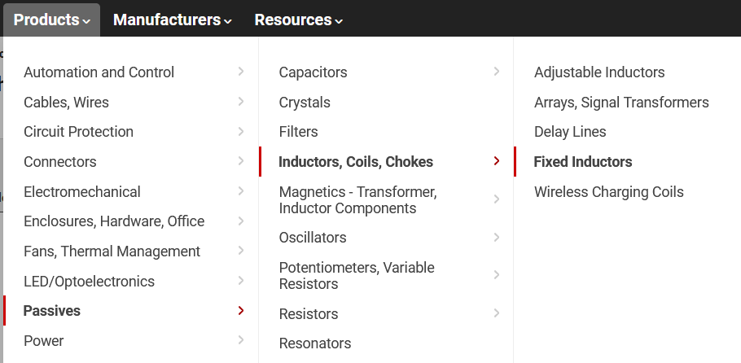  <!--kg-card-end: html--><!--kg-card-begin: markdown-->
The three important search factors for inductors being used for this power application are the inductor value (L, in <strong>H</strong>enries), saturation current, and <strong>DCR</strong>esistance. Follow the recommendations in the datasheet for the part you've chosen for each of these factors (they cover the math, but for a more thorough understanding of calculating inductor requirements, take EE 113 Power Electronics!). For example, the TPS61023 recommends using an inductor with <strong>1 uH</strong> value, <strong>9.0 A</strong> saturation current, and a DCR of <strong>sub 15 mOhm</strong> (ideally, DCR is 0, so the general idea you want is to <em>minimize</em> the DCR in the inductor you find). As for footprint, inductors are really just packages of coiled wire, so unlike resistors and capacitors, it is more common to find inductors in weird, non-standardized packages described by their dimensions. For this lab, try to find an inductor <em>around</em> 4mm x 4mm (there are a lot of very close dimensions, try searching with <em>all</em> of them).

<!--kg-card-end: markdown--><!--kg-card-begin: html--> 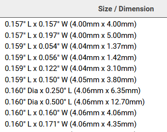  <!--kg-card-end: html--><!--kg-card-begin: markdown-->

<!--kg-card-end: markdown--><!--kg-card-begin: markdown--><h1 id="lab-checkoff">Lab Checkoff</h1>

Make sure you have...

<ul>
<li>Answers to the USB Charging Spec questions</li>
<li>A BOM with:
<ul>
<li>USB receptacle</li>
<li>Fuse for overcurrent protection</li>
<li>Schottky diode for reverse polarity protection</li>
<li>SMD indicator LED and resistor</li>
<li>Switching regulator (DC-DC power conversion)</li>
<li>Additional components/passives related to the switching regulator (capacitors, resistors, indutors, possibly a transistor)</li>
<li>You do not need to worry about input power from the batteries (we will use a standard <a href="https://en.wikipedia.org/wiki/Pin_header?ref=ieee.berkeley.edu">pin header</a>)</li>
</ul>
</li>
</ul>
<!--kg-card-end: markdown--><!--kg-card-begin: html-->      

<a href="https://ieee.berkeley.edu/hope/" style="font-weight: 700;">HOPE Main Page</a>

<!--kg-card-end: html-->
</article>