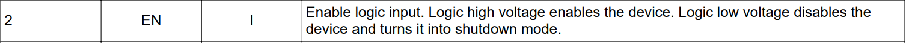

USB Charger Lab - Schematic
==============

* Do not remove this line (it will not be displayed)
{:toc}

<h1>USB Charger: Schematic</h1>

<article>
<!--kg-card-begin: html-->
<!--kg-card-end: html--><!--kg-card-begin: html-->      

<a href="https://ieee.berkeley.edu/hope/" style="font-weight: 700;">HOPE Main Page</a>

<!--kg-card-end: html--><!--kg-card-begin: markdown--><h1 id="schematicdrawing">Schematic Drawing</h1>

With the parts you have chosen from the previous lab and the provided block diagram, you're ready to start drawing the schematic.

<strong>Open KiCad and draw a schematic for your USB charger.</strong>
 

   

Above is a refresher from the last lab as to what is expected for the schematic. For example, you may want a 01x02 connector symbol for the input power receptacle (aka connector to battery).

Many parts, including R, C, and L, come in the <code>_Small</code> varieties, which simply are smaller, more compact symbols, and may help make your schematic look neater.

<blockquote>

Feel free to use these resources for <a href="https://manual.dexpcb.com/footprint-reference-ids.htm?ref=ieee.berkeley.edu">standard component designators</a> and <a href="https://www.rapidtables.com/electric/electrical_symbols.html?ref=ieee.berkeley.edu">common component symbols</a>

</blockquote>

For any schematic design, it is a good idea to start with the core components/submodule in the circuit. In the case of our phone charger, what is the core submodule/component?

If your design pretty much follows the application circuit, you may want to draw your circuit similar to the datasheet but also incorporating ideas of flow from left to right.

Try to name as many nets as possible with useful names! The datasheet(s) may help with this.

<h2 id="schematicsymbols">Schematic Symbols</h2>

You might notice that in general, KiCad's symbol libraries may not have all the parts you want to use. When this happens, you have two options as described below to add more part symbols to your KiCad.

For this lab, please use follow <strong>Method A for your regulator IC</strong>. For your USB connector, you can use the generic USB A symbol in KiCad. You <strong>should also add the DigiKey library by following Method B below</strong>, regardless of whether there are already KiCad symbols available:

<strong>A</strong>. Create a symbol yourself from the datasheet (it will help to have the component datasheet open and ready to go before starting). <strong><a href="https://docs.google.com/presentation/d/1_LhTxAqtXAgTtaF7BMxn-zAdomglfNoVxemuDgUhpzw/edit?usp=sharing&amp;ref=ieee.berkeley.edu">Follow along in these slides from the lecture</a></strong>.

<blockquote>

<strong>HINT</strong>: we <em>highly</em> recommend going through that slide deck above for this lab

</blockquote>

<strong>B</strong>. Download, import, and check  a symbol from an online service

<ol>
<li>Go to the <a href="https://www.digikey.com/en/resources/design-tools/kicad?ref=ieee.berkeley.edu">DigiKey website</a> and download the DigiKey library.</li>
<li>In KiCad go to the 'Symbol Editor' application and click Preferences → Manage Symbol Libraries → the Global Libraries tab → Folder Icon (Add existing library to table) and go to the location where the DigiKey library was downloaded. Go into the digikey-symbols folder and select all of the .lib files.</li>
</ol>
<blockquote>

Oftentimes, component libraries downloaded from the internet are incorrect and it is your job as the designer to verify that the symbol is what you want. This is especially applicable if you choose a service like <a href="https://www.snapeda.com/?ref=ieee.berkeley.edu">SnapEDA</a>.

</blockquote>
<!--kg-card-end: markdown--><figure class="kg-card kg-image-card"></figure><!--kg-card-begin: markdown--><h2 id="checkoff">Checkoff</h2>

Make sure to keep your schematic and your BOM intact for future lab assignments.

For the actual checkoff:

<ul>
<li><strong>Show us your completed schematic and demonstrate it passes ERC</strong></li>
<li>Walk through the major sections of your schematic</li>
<li>Compare the part symbol you made and the one you imported to their respective datasheets. Did you have to make this symbol if we did not explicitly ask you to?</li>
<li>Optional: Make schematic look like the block diagram using the single-page schematic blocking method as talked about in the Requirements/Design Abstraction lecture. Walk through how the individual components fullfil the abstracted version's block functions. <em>Highly recommended for improving readability!</em></li>
</ul>
<!--kg-card-end: markdown--><!--kg-card-begin: markdown--><h2 id="nextsteps">Next Steps</h2>

After completing your schematic, you should be almost ready to continue onto the board layout. <strong>Assign all your reference designators</strong> if you haven't done so already (if you are doing this manually don't forget there is a button that does this automatically!) then <a href="https://hope.berkie.ee/labs/lab2b#light-sensor-lab---layout">assign footprints</a> according to the parts you selected.

<blockquote>

Cannot find the footprint you need? You can <a href="https://hope.berkie.ee/notes/note3">make you own or import one</a> from online.

</blockquote>
<blockquote>

FAQ for the switching regulator, if you have an EN pin connect it to V_in directly! A lot of pin assignments can be determined by checking the component datasheet. In this case, we see from the datasheet that we need to tie the enable pin high, hence we connect it to V_in on the schematic. 
   

</blockquote>
<blockquote>

You should note that we have not given any kind of considerations for the layout. Though, maybe there are some things you can already start to think about, such as the fact that this PCB will be paired with 3 AA batteries.

</blockquote>

You can move on to starting your layout, but note that you <em>may</em> be required to change things next week!

<!--kg-card-end: markdown-->
<!--kg-card-begin: html-->      

<a href="https://ieee.berkeley.edu/hope/" style="font-weight: 700;">HOPE Main Page</a>

<!--kg-card-end: html--><!--kg-card-begin: html-->
<!--kg-card-end: html-->
</article>