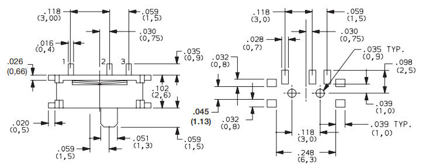
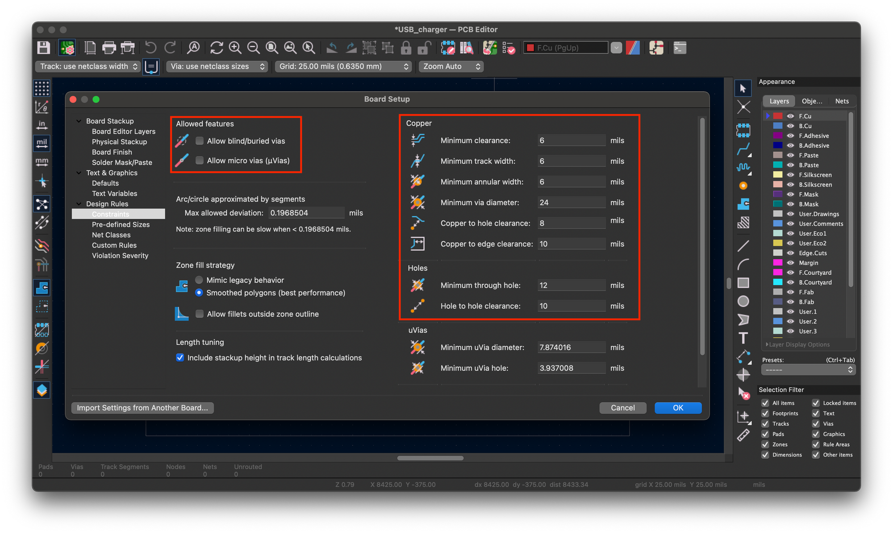
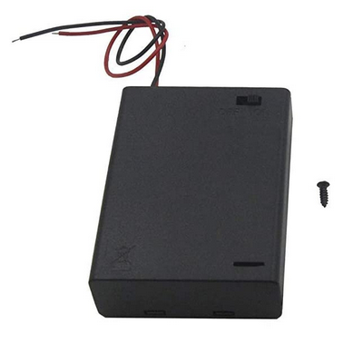
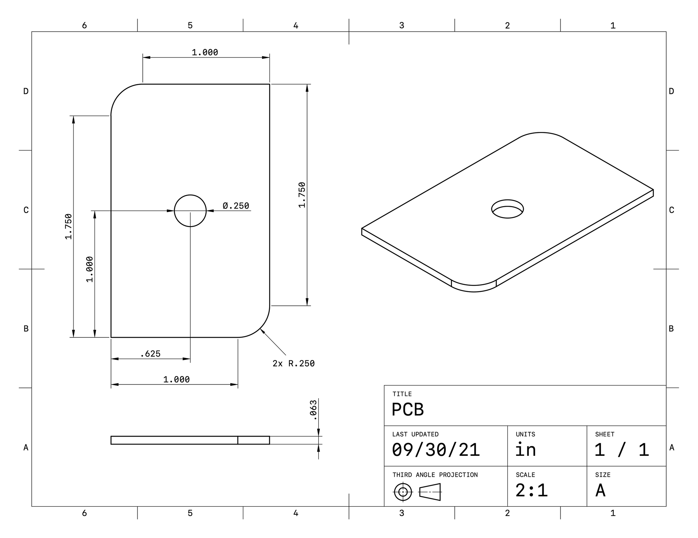
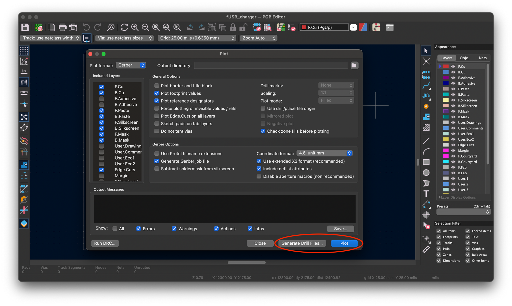

USB Charger Lab - Layout
==============

* Do not remove this line (it will not be displayed)
{:toc}

<h1>USB Charger: Layout</h1>

<article>
<!--kg-card-begin: html-->

<a href="https://ieee.berkeley.edu/hope/" style="font-weight: 700;">HOPE Main Page</a>

<!--kg-card-end: html-->
<!--kg-card-begin: markdown--><h1 id="layout">Layout</h1>

Now that you have your USB charger designed and parts picked out, you can start the layout right? Not so fast! There are a couple more things to consider.

<!--kg-card-end: markdown--><!--kg-card-begin: markdown--><h2 id="reviewingcomponentfootprints">Reviewing component footprints</h2>

Do you have a footprint for everything? If you haven’t already done so, from the schematic you’ll need to map every symbol to a physical footprint that matches the physical part you chose. Usually most footprints you run across will be standardized ones that are in the KiCAD library already. However, in the off chance you have some somewhat special part that doesn’t already exist, you’ll need to make your own just like how custom symbols are made. We've made a <a href="https://ieee.berkeley.edu/footprint-creation/">tutorial on how to do this <strong>here</strong></a>.

While we didn't really think of this during the component selection process, it's important to keep in mind the size of all the parts and the final PCB. Does everything fit on the board, where you want them to go?

<em>Optional</em>: A fun exercise in making custom footprints would be to make <a href="https://www.digikey.com/en/products/detail/c-k/PCM12SMTR/1640112?ref=ieee.berkeley.edu">this switch</a>. It's relatively complicated dimensionally, and if you can make this you can probably make any footprint. Land pattern on the right, from the datasheet.

<!--kg-card-end: markdown--><!--kg-card-begin: html-->   <!--kg-card-end: html--><!--kg-card-begin: markdown--><h2 id="boardsetup">Board Setup</h2>
<h3 id="designrulereview">Design Rule review</h3>

Is everything okay for standard manufacturing? The board manufacturer that sponsors this class is <a href="https://bayareacircuits.com/?ref=ieee.berkeley.edu">Bay Area Circuits</a>, and as a result, we need to follow their manufacturing capabilities for our boards to be made. In KiCad we can set up the rules that our design must follow under <code>File &gt; Board Setup</code>. Then click on <code>Design Rules &gt; Constraints</code>, and then fill in the values according to this <a href="https://bayareacircuits.com/pcb-capabilities/?ref=ieee.berkeley.edu">table of capabilities</a>. There is also a subcategory under Design Rules called Net Classes, and you can set different rules for different types of nets (e.g. power should have a thicker minimum width).

For your convenience, under <code>Pre-defined Sizes</code>, you should add some standard track widths and via sizes so during actual routing you can quickly switch between your values. Some “normal” widths would be like 6 mils, 8 mils, 10 mils, 12 mils, 15 mils, 20 mils, and 25 mils. Similarly for vias, set up some nice round numbers from the minimum via size upwards (making sure the size is 2x the drill).

<blockquote>

While we encourage you to try filling out the constraints from Bay Area Circuits yourself, you can also just make sure your Design Rules match the values in the red boxes below. You should try to understand where these values come from:

</blockquote>
<!--kg-card-end: markdown--><figure class="kg-card kg-image-card kg-card-hascaption"><figcaption>Design Rule Constraints</figcaption></figure><!--kg-card-begin: markdown--><h2 id="mechanicalconstraints">Mechanical constraints</h2>

Imagine another engineer has asked you to design your PCB so that it fits into a battery case like the one pictured below.

<!--kg-card-end: markdown--><!--kg-card-begin: html-->   <!--kg-card-end: html--><!--kg-card-begin: markdown-->
The other engineer has given you a dimensioned drawing of the shape of your PCB. You should draw the board outline in the <code>Edge.Cuts</code> layer so that your PCB conforms to these dimensions.

<blockquote>

Note 1: The 0.063" dimension is for the thickness of the PCB. This should be the default thickness that the PCB editor is set to. If you want, you can change the thickness of your PCB by going to the <code>Board Setup</code> window in the PCB Editor.

</blockquote>
<blockquote>

Note 2: There is a hole in the middle of the board. You can imagine that this hole might be required so that a mounting post or screw can pass through the PCB, or for another engineering reason.

</blockquote>
<!--kg-card-end: markdown--><figure class="kg-card kg-image-card kg-card-hascaption"><figcaption>Board dimensions.&nbsp;</figcaption></figure>

<!--kg-card-begin: markdown--><h2 id="whatsinalayout">What's in a layout?</h2>

Now you have all your parts and their footprints imported into an outline you've drawn, it's time to begin putting all the parts in reasonable places and begin routing.

Some suggestions:

<ul>
<li>USB port needs to be accessible: should probably be on the edge if it is a horizontal receptacle</li>
<li>Group together parts like in your block diagram before routing</li>
<li>Route ground with a plane</li>
<li>Don't forget you have two sides to route on</li>
</ul>

<em>Optional</em>: You can output the board as a 3D model file (a .step). Does it match up to a 3D modeled enclosure?

<!--kg-card-end: markdown--><!--kg-card-begin: markdown--><h2 id="glossary">Glossary</h2>
<ul>
<li>

<strong>net</strong> 
Schematic representation of a circuit node

</li>
<li>

<strong>net class</strong> 
Group of nets with similar characteristics or functions. Used in KiCad to set different design rule constraints for different nets

</li>
<li>

<strong>power net</strong> 
Net dedicated to carrying power, such as GND, 5V...

</li>
<li>

<strong>via</strong> 
A hole drilled into the board, then electroplated, to enable connections 
between layers in a PCB

</li>
<li>

<strong>thermal vias</strong> 
A via used primarily for its thermal conduction properties to carry away 
excess heat from a circuit device

</li>
<li>

<strong>filled zone/copper pour</strong> 
a polygon shape of copper. typically used for power distribution

</li>
</ul>
<!--kg-card-end: markdown--><!--kg-card-begin: markdown--><h2 id="checkoff">Checkoff</h2>

For the actual checkoff:

<ul>
<li>Have correct design rule set up</li>
<li>Have a fully routed layout that fits in one of the above outlines
<ul>
<li>Not just 0 unrouted, but everything is routed well (using planes, no wild loops, etc).</li>
<li>In the 3D view the height of the design is within specified limits</li>
</ul>
</li>
<li>Run DRC and show your design passes</li>
</ul>

<em>Optional</em>: If you wanted to get this board actually made, you will need to export something called Gerbers. Gerbers are set of files that the manufacturer can read for fabrication. Under <code>File &gt; Fabrication Outputs &gt; Gerbers (.gbr)</code>, you'll get a window to output Gerbers. The exact format to use will depend on manufacturer, but you need to export all the relevant layers and drill files. Bay Area Circuits has a handy online serivce to check your Gerbers are within their design capabilities <a href="https://instantdfm.bayareacircuits.com/?ref=ieee.berkeley.edu">here</a>.

<!--kg-card-end: markdown--><figure class="kg-card kg-image-card kg-card-hascaption"><figcaption>Gerber export. Click "Plot" first, then click "Generate Drill Files"</figcaption></figure>
<!--kg-card-begin: html-->      

<a href="https://ieee.berkeley.edu/hope/" style="font-weight: 700;">HOPE Main Page</a>

<!--kg-card-end: html--><!--kg-card-begin: html-->
<!--kg-card-end: html-->
</article>