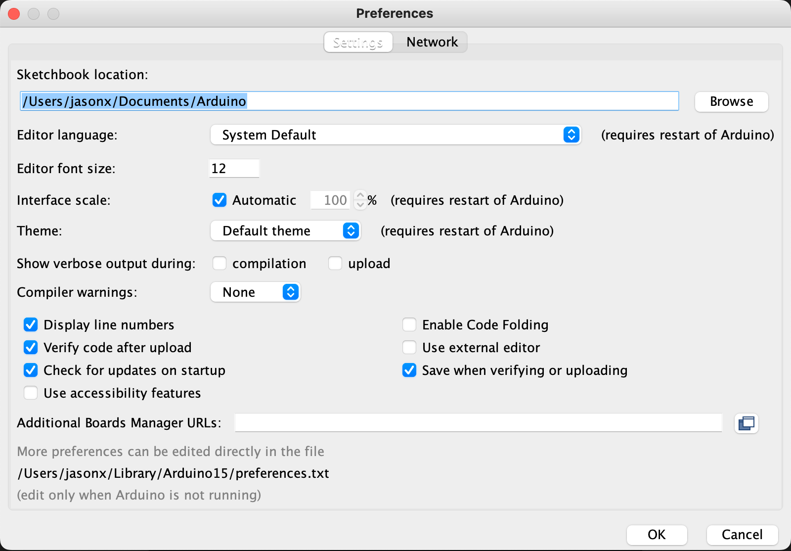

Trinket Lab
==============

* Do not remove this line (it will not be displayed)
{:toc}

<h1>HOPE: Trinket Lab</h1>

<article>
<!--kg-card-begin: html-->
<!--kg-card-end: html--><!--kg-card-begin: html-->      

<a href="https://ieee.berkeley.edu/hope/" style="font-weight: 700;">HOPE Main Page</a>

<!--kg-card-end: html--><!--kg-card-begin: markdown--><h1 id="introduction">Introduction</h1>

This lab will go through how to program an ESP32-S2 with the Arduino environment and perform common project debugging procedures. You'll learn how to use the oscilloscope to look at and understand PWM and I2C signals.

<!--kg-card-end: markdown--><figure class="kg-card kg-image-card"></figure><!--kg-card-begin: markdown--><h1 id="before-or-during-lecture">Before or During Lecture</h1>
<ol>
<li>Install the Arduino IDE: <a href="https://www.arduino.cc/en/software?ref=ieee.berkeley.edu">https://www.arduino.cc/en/software</a></li>
<li>Launch and navigate to the File &gt; Preferences Window</li>
<li>Under “Additional Board Manager URLs” add the following link <a href="https://raw.githubusercontent.com/espressif/arduino-esp32/gh-pages/package_esp32_index.json?ref=ieee.berkeley.edu">https://raw.githubusercontent.com/espressif/arduino-esp32/gh-pages/package_esp32_index.json</a> to the textbox.</li>
<li>Go to Tools &gt; Board &gt; Boards Manager and search up esp32 in the top. Install the esp32 package by Espressif Systems</li>
<li>We’ll be using a pre-written library to communicate with the temperature sensor. 
a. To install it, navigate to Sketch &gt; Include Library &gt; Manage Libraries 
b. Search up <strong>PCT2075</strong> and install the Adafruit library. Do the same for the <strong>BusIO</strong> library. If you get a message along the lines of "The library (name) needs some other dependancies...", click "Install all"</li>
</ol>
<!--kg-card-end: markdown--><!--kg-card-begin: markdown--><h1 id="programming-and-general-reference">Programming and General Reference</h1>
<h2 id="scope-setup">Scope setup</h2>

Turn your scope on. The power button may require a strong press.

Make sure that all channels are set to DC coupling! AC coupling means all DC voltages will be ignored (same as adding a capacitor in series with the sense line) and will be useless for this lab. Press the channel button (e.g. "1") to open the relevant menu.

Make sure you are using oscilloscope probes (grey), not the signal generator leads (black, with two alligator clips). You may need to gently remove the probe cap to reach some signals. <strong>Please re-attach the probe cap when done--they can cost up to $100 to replace!</strong>

<h2 id="trinket-schematic">Trinket schematic</h2>

Below is part of the schematic showing which pins are connected to what on the trinket. The bottom two pins are SDA (top) and SCL (bottom) for the I2C:

<!--kg-card-end: markdown--><!--kg-card-begin: markdown--><h1 id="part-0-downloading-starter-code-and-programming">Part 0: Downloading Starter Code and Programming</h1>

Download our starter Arduino code here: <a href="https://gist.github.com/rgovindjee/4d0c31d0e8dcb66c9798764f958552e0?ref=ieee.berkeley.edu">https://gist.github.com/rgovindjee/4d0c31d0e8dcb66c9798764f958552e0</a>

First, we recommend you display line numbers: 

The next thing you should do is change these lines appropriately: 

<strong>The password must be greater than or equal to 8 characters long.</strong>

<h2 id="arduino-ide-setup">Arduino IDE Setup</h2>

Before flashing and programming:

<ul>
<li>Under Tools &gt; Board, choose <strong>ESP32S2 Dev Module</strong></li>
<li>make sure <strong>USB CDC on Boot is set to "Enabled"</strong></li>
<li>upload mode is <strong>Internal USB</strong></li>
</ul>

All settings should match the image below.

<h2 id="first-time-programming-instructions">First-time programming instructions</h2>
<ol>
<li>Press and <strong>hold down</strong> the BOOT button on the trinket.</li>
<li>While holding down boot, press and <strong>release</strong> the RESET button.</li>
<li>Release the BOOT button.</li>
</ol>

Choose the right port under Tools &gt; Port.

On Windows, this may require opening Device Manager to check which COM port your board is available on (You are looking for a "USB Serial" device):

or on MacOS:

<ol>
<li>Open terminal and type: ls /dev/*.</li>
<li>Note the port number listed for /dev/tty.usbmodem* or /dev/tty.usbserial*. The port number is represented with * here.</li>
</ol>

Click on the upload button (the right pointing arrow in the toolbar) 

and the status console at the bottom should eventually show some text about data being written to the ESP32.

You <strong>should</strong> get an error asking you to reset the board. 
Press and release the RESET button. Your code should now be running.

NOTE: Mac users, if you get an error with Arduino not finding python in $PATH, try the following command in terminal:

<ul>
<li><code>sed -i -e 's/=python /=python3 /g' ~/Library/Arduino15/packages/esp32/hardware/esp32/*/platform.txt</code></li>
</ul>
<h2 id="programming-instructions-after-the-first-time">Programming instructions after the first time</h2>

Check that the correct port is selected in the Tools &gt; Port menu. <em>It may change after first-time programming</em>.

You should be able to upload new firmware with the Upload button without having to physically press any buttons on the trinket board (they are controlled automatically by the ESP32-S2). If this is not the case, check that your settings are current under Tools (see above) and repeat first-time programming.

<!--kg-card-end: markdown--><!--kg-card-begin: markdown--><h1 id="part-1-blinking-and-fading-leds-with-pwm">Part 1: Blinking and Fading LEDs with PWM</h1>

There’s a RGB LED in the middle of the board. We’ve pre-defined the pins in the starter code (blue on pin 10, red on pin 11, green on pin 12).

We’ve written some code to cycle the LED through a rainbow. 
<strong>Uncomment the block of code labeled Part 1 in the loop function</strong> and for the later parts of the lab uncomment their respective blocks.

The brightness is controlled by PWM’ing each color channel. In code this is done with the analogWrite function, which takes in the pin you want to write to and a value from 0 to 255 for the duty cycle. Upload the code and then use the oscilloscope to probe the R, G, and B channels. We’ve exposed the signals to pads along the edge for easy probing.

<!--kg-card-end: markdown--><!--kg-card-begin: markdown--><h3 id="pwm-testing">PWM Testing</h3>

First, what is PWM? PWM stands for <strong>P</strong>ulse <strong>W</strong>idth <strong>M</strong>odulation, and is a way to <em>approximate</em> an analog voltage with a purely digital signal. Digital signals only have 2 discrete states: HIGH and LOW (on and off, 1 and 0, etc.). However, if you flip between the HIGH and LOW states fast enough, the <em>average</em> output voltage over a period of time then resembles some continuous value inbetween the HIGH and LOW voltages. Subsequently, we can change this perceived average continuous value by changing the <strong>duty cycle</strong> of the HIGH-LOW oscillation. The duty cycle is the % of time in a period that the output is HIGH.

<!--kg-card-end: markdown--><!--kg-card-begin: html-->   <!--kg-card-end: html--><!--kg-card-begin: markdown-->
Using the scope to see the PWM signal:

<ul>
<li>Set horizontal scale to <strong>1 ms/division</strong></li>
<li>Set vertical scale to <strong>2 V/div</strong></li>
<li>Connect probe GND to GND</li>
<li>Touch probe tip to any of the RGB pads along the edge.</li>
<li>Set trigger to <strong>Edge</strong> mode, on the channel that you're using (typ. <strong>channel 1</strong>), and to trigger on either only falling or <strong>only rising edges</strong> (not both).</li>
<li>Set the trigger to <strong>~1.8V</strong> using the knob under the Trigger controls (this should cause the waveform to align on your screen around a single edge)</li>
</ul>

Depending on the last person to use the scope, you <strong>may</strong> have to lower the holdoff time (lockout before re-trigger) to get the waveform to display smoothly.

Go to the trigger settings by pressing "Mode":

And adjust as low as 90ns using the knob with the ⟲ light next to it.

<strong>This primarily applies to the older (gray) scopes, but may be needed on newer (black) scopes as well.</strong>

<!--kg-card-end: markdown--><!--kg-card-begin: markdown--><h3 id="checkoff-requirements">Checkoff requirements</h3>

<strong>Checkoff task: Take a picture with your phone of one of the channels.</strong>

<strong>Checkoff question: Along with the picture of the PWM waveform, what’s the PWM frequency?</strong> You can choose to count divisions, use the cursors, or use the Measure functions in the oscilloscope.

<!--kg-card-end: markdown--><!--kg-card-begin: markdown--><h1 id="part-2-capacitive-touch-sensors">Part 2: Capacitive Touch Sensors</h1>

On the left and right of the board are capacitive touch sensors: a slider on the left and three individual buttons on the right. When you put your finger on the pads, your body changes the capacitance on the node and the microcontroller can detect this change with some clever timing of discharge time of an RC circuit.

<strong>Uncomment the block of code labeled Part 2 in the loop function</strong>. 
You may leave Part 1 running.

The starter code prints out the reading from the touch pads. To see the values, go to Tools &gt; Serial Monitor. Make sure the baud rate in the bottom right is 115200.

The capacitive touch <em>may</em> work better if you lift the trinket off the mat/table.

<strong>Checkoff task: Write some code that changes the LED based on if your finger is on a pad.</strong>

<em>Hint (Optional):</em> You may get better results if you set a threshold for the <em>rate of change</em> of capacitive touch values instead of threshold for a raw capacitance value. This is not requried to get checked off, though.

<!--kg-card-end: markdown--><!--kg-card-begin: markdown--><h1 id="part-3-analog-light-sensor">Part 3: Analog Light Sensor</h1>

We have a BH1603 ambient light sensor (ALS) on the board with an analog output.

We can read analog input pins with analogRead, which outputs a value from 0 to 4095 that is roughly proportional to 0 to 2.5V (when using the ADC in the most common mode).

<strong>Uncomment the block of code labeled Part 3 in the loop function</strong>. 
You may leave Part 2 running.

<strong>Checkoff task: Use the oscilloscope or multimeter to probe the output of the sensor and see how it changes under different lighting conditions. Does the voltage go up or down when more light is available?</strong>

<!--kg-card-end: markdown--><!--kg-card-begin: markdown--><h1 id="part-4-temperature-sensor-and-i2c">Part 4: Temperature Sensor and I2C</h1>
<!--kg-card-end: markdown--><!--kg-card-begin: markdown-->
We have a PCT2075 temperature sensor on the board that is connected to the ESP32 by I2C. If you haven’t already done so, install the required libraries to communicate with the sensor by following the instructions in the prelab.

The default code will print out the temperature from the sensor.

<strong>Uncomment the block of code labeled Part 4 in the loop function</strong>. 
You may leave Part 3 running.

<!--kg-card-end: markdown--><!--kg-card-begin: markdown--><h3 id="i2c">I2C</h3>

I2C is a two wire serial communication protocol (also called two wire interface, or TWI) that is commonly used to interface microcontrollers, sensors, and other embedded hardware. One wire is used for the clock (SCL), which tells the devices when to read the data bits. The other wire is the data line (SDA) and carries data to and from devices.

Every device on the bus has an address, and up to 127 different devices can be on one set of two wires assuming they all have unique addresses. A good reference on this can be found on <a href="https://www.analog.com/en/technical-articles/i2c-primer-what-is-i2c-part-1.html?ref=ieee.berkeley.edu">Analog Device's website</a>.

All data packets going from the microcontroller to the device that we want to talk to on the bus are prefixed with the address of the device. All the devices on the bus listen to this address and if it matches their internal address, they will reply while the rest remain silent.

<!--kg-card-end: markdown--><!--kg-card-begin: html-->   

<!--kg-card-end: html--><!--kg-card-begin: markdown-->
Use the oscilloscope with two probes and probe the SDA and SCL lines of the I2C bus. Capture the transmission of a single packet of data (use single triggering on the SDA lines). The address of the temperature sensor is the first byte of any transmission. Can you decode the data and read out the address? The data line is sampled while the clock is <strong>high</strong>, and the address is <strong>7 bits</strong>.

<h3 id="scope-setup-mostly-for-grey-oscilloscopes">Scope Setup (mostly for grey oscilloscopes)</h3>

If you are using one of the newer (black) oscilloscopes, this may section <em>may</em> apply. Only follow these instructions if you are unable to capture the waveform using the "How to use Single Trigger instructions below".

For older scopes, you will have to adjust the "holdoff" time--this causes the scopes not to immediately force a capture after no trigger edge is detected in one window.

Go to the trigger settings by pressing "Mode":

And adjust to 1-2s

<h3 id="how-to-use-single-trigger">How to use Single Trigger</h3>

You may have to remove the hook attachment on one or both probes to physically be able to probe these signals. <strong>MAKE SURE BOTH GROUND CLIPS ARE CONNECTED TO A BOARD GND!</strong>

<ol>
<li>Probe both the SDA and SCL lines and turn on both of the channels your probes are on (press the button "2" to enable Channel 2).</li>
<li>Set the trigger level to 1.8 V (trigger menu); you can set the trigger to either channel.</li>
<li>Set the horizontal scale to 20 us/div</li>
<li>Set the vertical scale to 1 V/div</li>
<li>Set the vertical offset to 2V (this centers the waveform so we can see all of it)</li>
<li>Arm the trigger by pressing the Single button. This may immediately cause a capture on the scopes we have in lab (this is not typical for scopes in general!), so you’ll need to press it again to capture the signal of interest.</li>
<li>You should now see some data and clock waveforms since we are reading the sensor periodically.</li>
</ol>

When the bus is not in use, both SDA and SCL will be pulled high (with pull-up resistors).

<strong>Checkoff task: Take a picture of the start of the packet and decode the device address using the diagram above. <a href="https://www.rapidtables.com/convert/number/binary-to-hex.html?ref=ieee.berkeley.edu">Convert the binary address to hex</a>. Note that many data bytes can be read/written after the device address.</strong>

<strong>Checkoff task: Zoom in to 200ns/div horizontal resolution and capture an image of a falling edge on either SDA or SCL. What do you notice about the waveform? Why doesn't this happen on the rising edge?</strong>

<!--kg-card-end: markdown--><!--kg-card-begin: markdown--><h1 id="part-5-wifi">Part 5: Wifi</h1>

<strong>Uncomment the block of code labeled Part 5 in the loop function</strong>. 
You may leave Part 4 running.

Upload your code to the trinket. In the Arduino Serial Monitor, note down the IP address being printed by your trinket.

Using your laptop, connect to the newly avaliable WiFi network (that should be your name if you followed Step 0!), using the password you set (which should be at minimum 8 characters long).

Verify that you have successfully connected. (NOTE: You may get a warning that the WiFi network is not connected to the internet, this is OK - ignore the warning and make sure you are connected regardless).

On your laptop, open the terminal or powershell or cmd prompt, and ping the IP address of your trinket by using:

<ul>
<li><code>ping IP_ADDRESS_HERE</code></li>
</ul>

(replace IP_ADDRESS_HERE with your trinket's IP).

<strong>Checkoff task: Take a screenshot of your terminal/powershell/cmd window showing the successful ping.</strong>

(Optional): In your project, you may want to communicate sensor data over WiFi. For the trinket, you can imagine communicating the temperature readings over WiFi. To do this, we often use a common IoT protocol called MQTT. Learn more about it here: <a href="https://learn.adafruit.com/adafruit-io/mqtt-api?ref=ieee.berkeley.edu">https://learn.adafruit.com/adafruit-io/mqtt-api</a>

(Optional): Try connecting to your neighbor's WiFi networks with the default password 'password' and shame them if they haven't changed it according to instructions.

<!--kg-card-end: markdown--><!--kg-card-begin: markdown--><h1 id="checkoff-requirements">Checkoff Requirements</h1>
<ul>
<li>PWM picture and PWM frequency</li>
<li>Capacitive touch causing some visible change on the board</li>
<li>Probe the light sensor output to see changes in voltage</li>
<li>I2C scope picture and decoded address</li>
<li>I2C falling edge picture and answer to "what is different about the falling and rising edges?"</li>
<li>Picture of successful ping</li>
</ul>
<!--kg-card-end: markdown--><!--kg-card-begin: html-->      

<a href="https://ieee.berkeley.edu/hope/" style="font-weight: 700;">HOPE Main Page</a>

<!--kg-card-end: html--><!--kg-card-begin: html-->
<!--kg-card-end: html-->
</article>